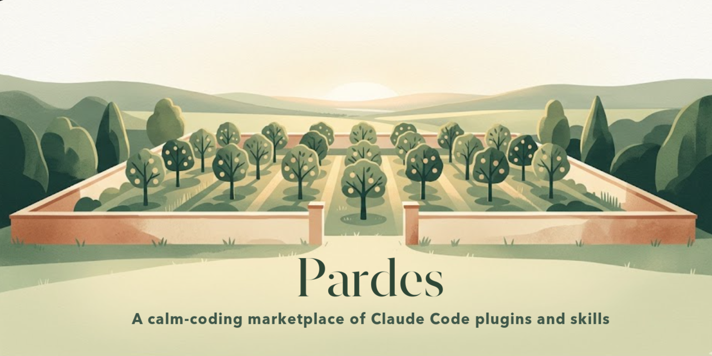

<p align="center">
  
</p>

*Pardes* (פרדס) means "orchard" or "walled garden" — the ancient root the word
*paradise* itself grows from. It's a calm-coding marketplace of [Claude Code](https://code.claude.com)
plugins and skills: a tended garden of small, sharp tools that make coding calmer
and more deliberate.

## Using the marketplace

```bash
# add this marketplace
/plugin marketplace add ShivaeDev/pardes

# browse and install plugins
/plugin
```

**New to pardes?** Install the `onboarding` plugin and run its skill — it gives
you a guided tour of what each plugin does and how they compose, then an
advisory check of your Claude Code settings (it never changes anything without
your explicit yes).

## Plugins

| Plugin | What it does |
| --- | --- |
| `base` | Foundational scaffold — shared hooks and core skills land here as the marketplace grows. |
| `onboarding` | Get oriented in the marketplace and tune your setup — explains what each plugin does and how they compose, then runs an advisory config doctor that reports recommended settings and applies them only with your explicit confirmation. |
| `orchestrate` | Plan a large multi-chunk PR through a user interview, then ship it by dispatching focused sub-agents one chunk at a time. |
| `pardes-all` | Meta plugin that depends on every other plugin — install it to pull in the whole marketplace at once (auto-install + auto-enable requires Claude Code v2.1.143+). |
| `pr-description` | Write a clear, useful PR description — a tight Why / How / Decisions / Callouts structure with no filler. |
| `shell-helpers` | Reusable orchestration shell helpers — freshen a checkout to a clean baseline, prune merged branches, and reap stale worktrees. |
| `shift-leader` | Run as the autonomous shift leader of a multi-PR / multi-agent effort — maximize progress, reach the away user only via AskUserQuestion, gate phases on PR merges (never merge yourself), and dispatch file-disjoint parallel worktree agents at high velocity. |
| `statusline` | A rich, multi-line status line for Claude Code — model, context-pressure bar, cost, git, PR, and rate limits on the main line, plus per-subagent gauges in the agent panel. |
| `workflows` | A starter library of reusable Workflow-tool orchestration scripts — adversarial writer→reviewer, read-only fan-out investigation, and parallel-edit-then-serialized-verify. |

## Install everything

Add the marketplace, then install the `pardes-all` meta plugin — it depends on
every other plugin, so this single install pulls them all in:

```bash
/plugin marketplace add ShivaeDev/pardes
/plugin install pardes-all@pardes
```

> Auto-installing and auto-enabling dependencies requires **Claude Code
> v2.1.143+**. On older versions, install each plugin explicitly (below).

To pick and choose, install plugins one at a time instead:

```bash
/plugin marketplace add ShivaeDev/pardes

/plugin install base@pardes
/plugin install onboarding@pardes
/plugin install orchestrate@pardes
/plugin install pr-description@pardes
/plugin install shell-helpers@pardes
/plugin install shift-leader@pardes
/plugin install statusline@pardes
/plugin install workflows@pardes
```

Or run `/plugin` to browse and install them interactively.

## Layout

```
.
├── .claude-plugin/
│   └── marketplace.json      # registers every plugin in this repo
├── changelog/
│   └── <plugin>.md           # per-plugin changelog (Keep a Changelog)
└── plugins/
    └── <plugin>/
        └── .claude-plugin/
            └── plugin.json   # name, version, description
```

## License

MIT
